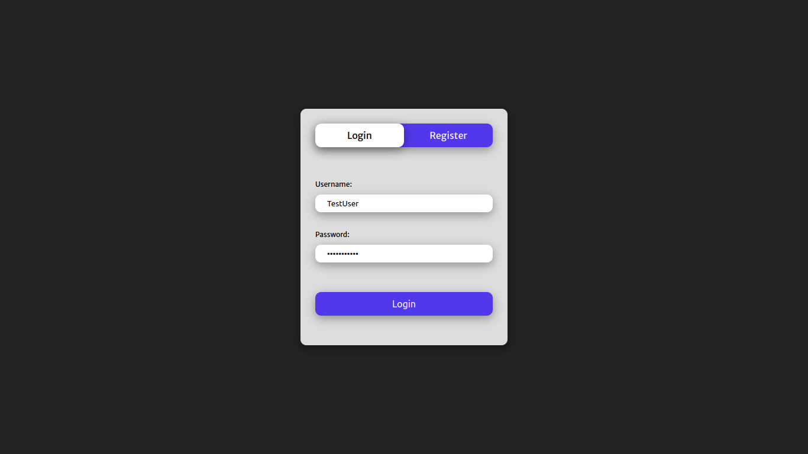

Task Manager app made by using Javascript, Node.js and MongoDB.

User data is stored on MongoDB.
I've used Node.js to create a REST API to communicate with database.

I used bcryptjs to hash passwords in order to make personal user data secure.

